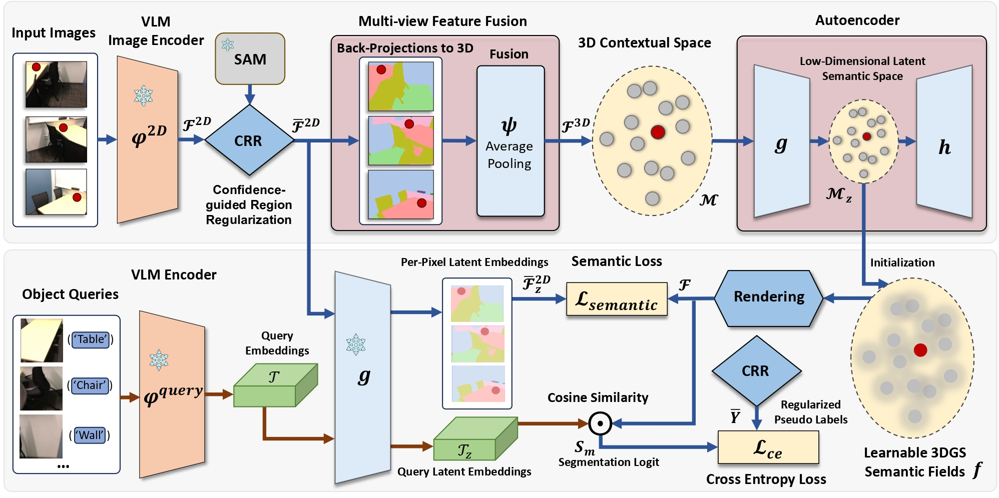

# econSG: Efficient and Multi-view Consistent Open-Vocabulary 3D Semantic Gaussians

## Abstract
The primary focus of most recent works on open-vocabulary neural fields is extracting precise semantic features from the VLMs and then consolidating them efficiently into a multi-view consistent 3D neural fields representation. However, most existing works over-trusted SAM to regularize image-level CLIP without any further refinement. Moreover, several existing works improved efficiency by dimensionality reduction of semantic features from 2D VLMs before fusing with 3DGS semantic fields, which inevitably leads to multi-view inconsistency. In this work, we propose econSG for open-vocabulary semantic segmentation with 3DGS. Our econSG consists of: 1) A Confidence-region Guided Regularization (CRR) that mutually refines SAM and CLIP to get the best of both worlds for precise semantic features with complete and precise boundaries. 2) A low dimensional contextual space to enforce 3D multi-view consistency while improving computational efficiency by fusing backprojected multi-view 2D features and follow by dimensional reduction directly on the fused 3D features instead of operating on each 2D view separately. Our econSG shows state-of-the-art performance on four benchmark datasets compared to the existing methods. Furthermore, we are also the most efficient training among all the methods.


## Framework



### 1. Preprocessing

- Extract features and masks from multi-view images
- Regularize the semantics via CRR 
- Training Latent model 

### 2. Semantic Gaussian Splatting


## Citation
```
@inproceedings{
    zhang2025econsg,
    title={econ{SG}: Efficient and Multi-view Consistent Open-Vocabulary 3D Semantic Gaussians},
    author={Can Zhang and Gim Hee Lee},
    booktitle={The Thirteenth International Conference on Learning Representations},
    year={2025},
    url={https://openreview.net/forum?id=qSEEQPNbu4}
}
```